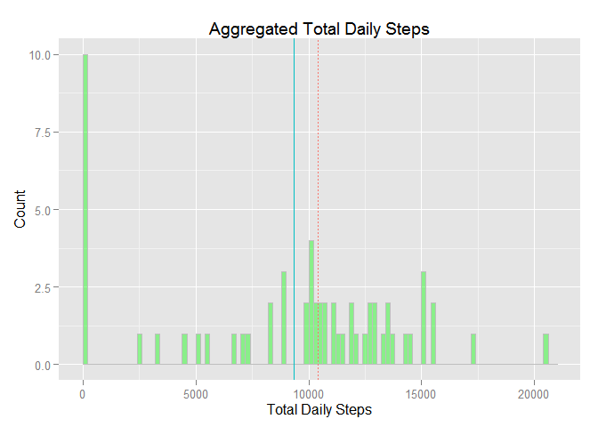
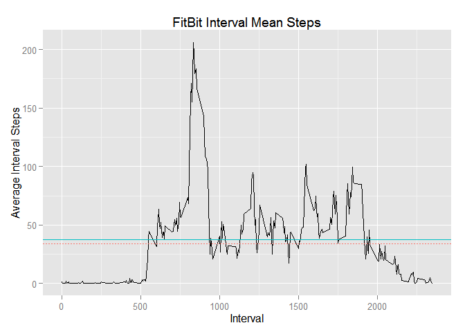
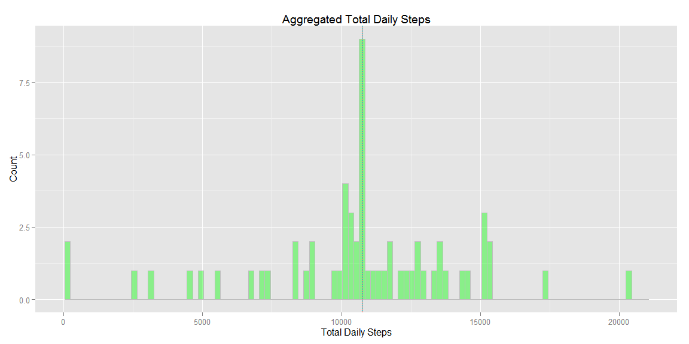
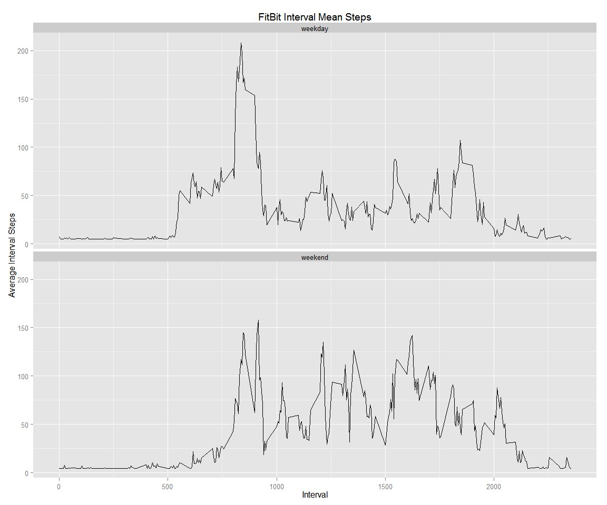

# Reproducible Research: Peer Assessment 1


### Loading and preprocessing the data

Load packages only as needed. Read Fitbit data and examine the fields and data types. Ensure that the character data isn't read in as factors, but as dates. 


```r
# Install function for packages    
packages<-function(x){
    x<-as.character(match.call()[[2]])
    if (!require(x,character.only=TRUE)){
        install.packages(pkgs=x,repos="http://cran.rstudio.com")
        require(x,character.only=TRUE)
    }
}
packages(ggplot2); packages(dplyr); packages(xtable); packages(knitr)
```


```r
options(scipen=999)
```


```r
# Read in the fitness data

fitDataRaw <- read.csv("activity.csv", stringsAsFactors = FALSE, sep="," )
fitDataRaw$date <- as.Date(fitDataRaw$date)  # Convert the character date to Date type

naCount <- length(which(is.na(fitDataRaw$steps)))

str(fitDataRaw)
```

```
## 'data.frame':	17568 obs. of  3 variables:
##  $ steps   : int  NA NA NA NA NA NA NA NA NA NA ...
##  $ date    : Date, format: "2012-10-01" "2012-10-01" ...
##  $ interval: int  0 5 10 15 20 25 30 35 40 45 ...
```

```r
summary(fitDataRaw)
```

```
##      steps             date               interval     
##  Min.   :  0.00   Min.   :2012-10-01   Min.   :   0.0  
##  1st Qu.:  0.00   1st Qu.:2012-10-16   1st Qu.: 588.8  
##  Median :  0.00   Median :2012-10-31   Median :1177.5  
##  Mean   : 37.38   Mean   :2012-10-31   Mean   :1177.5  
##  3rd Qu.: 12.00   3rd Qu.:2012-11-15   3rd Qu.:1766.2  
##  Max.   :806.00   Max.   :2012-11-30   Max.   :2355.0  
##  NA's   :2304
```

Examining the data, it is apparent that there is a lot of NA data. There are a total of 17568 records. Of these, there are naCount records with no step data.

### What is mean total number of steps taken per day?


```r
# Create a new data frame with summary counts of the total daily steps. Convert NAs to zero 
# for plotting. 

sumSteps <- fitDataRaw %>%
    group_by(date) %>%
    summarise(totalSteps=sum(steps)) %>%
    mutate(totalSteps = ifelse(is.na(totalSteps), 0, totalSteps))

g = ggplot(data=sumSteps, aes(x=totalSteps)) 
g = g + geom_histogram(breaks=seq(min(sumSteps$totalSteps), 
                                  max(sumSteps$totalSteps), by = 200),
                       col="gray", fill = "green", alpha = .4)
g = g + ylab("Count") + xlab("Total Daily Steps") + ggtitle("Aggregated Total Daily Steps")  
g = g + geom_vline(aes(xintercept=mean(sumSteps$totalSteps), color="red", linetype="dashed"))
g = g + geom_vline(aes(xintercept=median(sumSteps$totalSteps), color="blue", linetype="solid"))
g 
```

 

The NA data was converted to zeroes so that the number of days with no data in these data is highlighted. 

Examining the data, it is apparent that these data are left skewed, hence the mean, 9354.2295082, is to the left of the median of 10395. These data were collected over two months. It is unlikely that there are 10 days of absolutely no steps, possibly indicating the Fitbit was faulty or not worn or turned off for the day. 

### What is the average daily activity pattern?


```r
# Create a new data frame with summary counts of the mean interval steps. Convert NAs to zero 
# for plotting. 

### NOTE: Need to treat integer "interval" as factor for group_by

meanIntSteps <- fitDataRaw %>%
    group_by(interval) %>%
    summarise(meanSteps=mean(steps, na.rm=TRUE)) 

# Max average mean daily interval
maxAvgSteps = meanIntSteps$meanSteps[which.max(meanIntSteps$meanSteps)]
maxAvgStepInterval = meanIntSteps$interval[which.max(meanIntSteps$meanSteps)]

g = ggplot(data=meanIntSteps, aes(x = interval, y = meanSteps)) + geom_line()
g = g + xlab("Interval") + ylab("Average Interval Steps") + ggtitle("FitBit Interval Mean Steps")
g = g + geom_hline(aes(yintercept=mean(meanIntSteps$meanSteps), color="red", linetype="dashed"))
g = g + geom_hline(aes(yintercept=median(meanIntSteps$meanSteps), color="blue", linetype="solid"))
g
```

 

The time series of daily average steps per interval demonstrates a peak of activity in the early part of the day, with an average number of 206 at time interval 835. Activity evens out throughout rest of day and is low during hours when a particpant sleeps. 


### Inputing missing values


```r
# Transform data frame by filling in the missing interval data with average interval data. 
# Compute the weekend/weekday data in preparation of next section. 

adjFitData <- fitDataRaw %>%
    group_by(date) %>%
    transform(steps = ifelse(is.na(steps), mean(steps, na.rm=TRUE), steps)) %>%
    mutate(day = weekdays(date)) %>%
    mutate(dayType = ifelse(day == "Saturday" | day == "Sunday", "weekend", "weekday")) 

# Create a new data frame with summary counts of the total daily steps. Convert NAs to zero 
# for plotting. 
sumSteps <- adjFitData %>%
    group_by(date) %>%
    summarise(totalSteps=sum(steps))

g = ggplot(data=sumSteps, aes(x=totalSteps)) 
g = g + geom_histogram(breaks=seq(min(sumSteps$totalSteps), 
                       max(sumSteps$totalSteps), by = 200),
                       col="gray", fill = "green", alpha = .4)
g = g + ylab("Count") + xlab("Total Daily Steps") + ggtitle("Aggregated Total Daily Steps")  
g = g + geom_vline(aes(xintercept=mean(sumSteps$totalSteps), color="red", linetype="dashed"))
g = g + geom_vline(aes(xintercept=median(sumSteps$totalSteps), color="blue", linetype="solid"))
g 
```

 

The missing data was converted to the average steps for a given interval across all days. 
When these missing data are considered, the mean, 10766, align with the median of 10766 and the data is not skewed. The mean has obviously increased a fair amount. It does not seem very likely for the mean and median to align so perfectly, so it's advisable in future analysis to investigate more sophisticated methods to process missing data. 


### Are there differences in activity patterns between weekdays and weekends?


```r
meanIntSteps <- adjFitData %>%
    group_by(dayType, interval) %>%
    summarise(meanSteps=mean(steps, na.rm=TRUE)) 

g = ggplot(data=meanIntSteps, aes(x = interval, y = meanSteps)) + geom_line() 
g = g + facet_wrap(~ dayType, ncol=1)
g = g + xlab("Interval") + ylab("Average Interval Steps") + ggtitle("FitBit Interval Mean Steps")
g
```

 

The time series of average steps per interval for the weekend versus for weekdays displays some interesting differences between the fitness participant's exercise behavior. These data demonstrate that on weekdays, there is a peak in activity early in the day, followed by significantly less activity midday, and slightly more in the evening. On the weekend, exercise begins later in the morning and stays relatively consistent throughout the day. 
